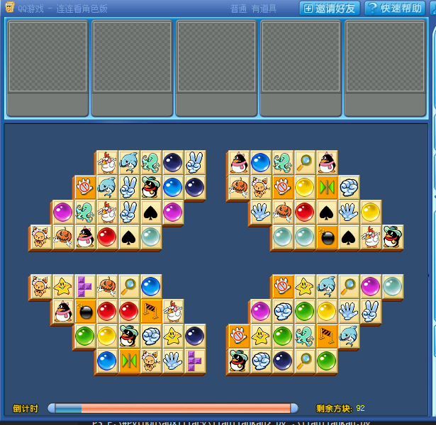
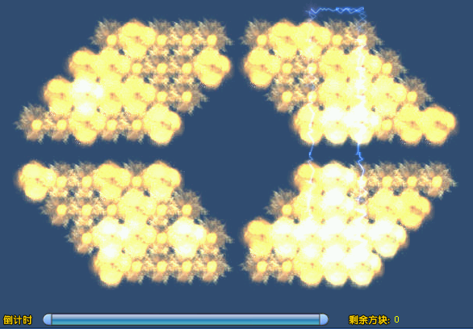

# lianliankan

仅用于学习, 请在练习模式下使用

## 使用环境
win7
> win10环境下无法使用

## 使用方法
```
$ py lianliankan.py
```
开始游戏后运行上面的命令就行了, 执行时会自动将游戏窗口最上层显示, 运行时不要遮挡游戏窗口, 因为需要从游戏界面截取方块信息

```
time.sleep(random.randint(0,0)/1000)
```
`lianliankan.py`的最后一行是点击间隔

代码不复杂, 主要的内容都在判断连接通路和图像是否相同上

## 效果图


